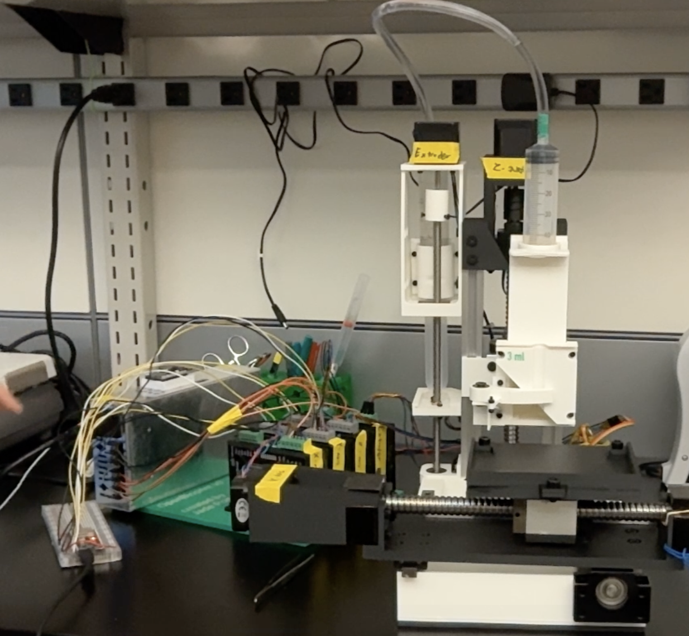
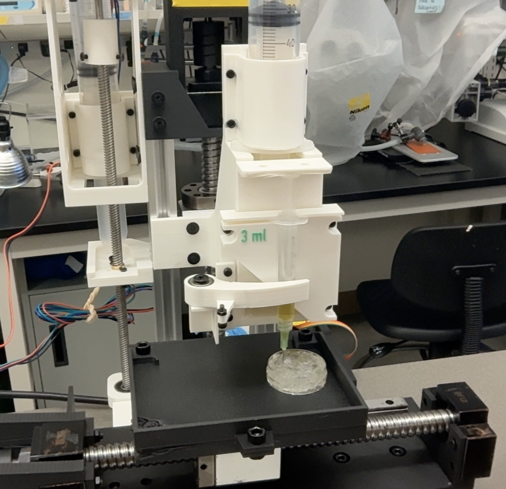

  
# Open Bioprint
  
An open source pneumatic extrusion based 3D bioprinter system.
  
### Technologies

 

# Table of Contents
- [About the Project](#about-the-project)
- [Version History](#version-history)
- [Acknowledgements](#acknowledgements)
- [Contact](#contact-me)

## About the Project

The aim of this project is to provide open source software and hardware to enable better access to 3D bioprinting technologies. The current design is intended to be made entirely from off the shelf and FDM 3D printed components.
Additionally, this project has recently started (begun near start of 08/2026) so designs are actively being iterated upon, and file availability may be intermittent until a more solid first revision is finalized.

## Version History

### Revision 0

 

  </img>
  
Prototype bioprinter in its current state

 

This current prototype version is based around 3 ball screw driven linear axes, with a pneumatic syringe pump to provide extrusion. This pneumatic pump actuates a syringe loaded with a bioink, enabling FRESH bioprinting and direct ink writing methods. The system has different syringe holding blocks that can be swapped out, ranging from 1-5 ml ink volumes. There may be an overhaul of this extrusion system to enable much larger ink volumes. 

The 'brain' of the machine currently is an ESP32-S3 dev board, programmed using platformIO.
Currently, the system can receive coordinate commands and move to that position while performing an extrusion. Current work items are related to getting a gcode interpreter working on the ESP32.

 

  </img>
  
test FRESH print using 2% alginate ink

 

## Acknowledgements
The Open Bioprint project was created and is maintained by [pyroxenes](https://github.com/pyroxenes).

## Contact Me
You can reach me through my contact email at [todo:📧](todo:📧)
